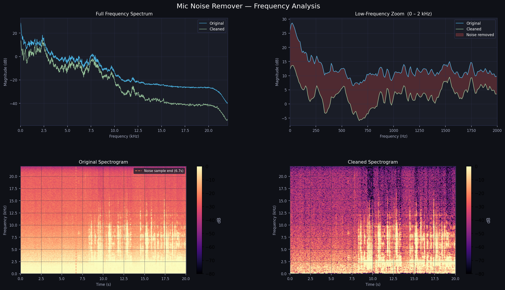

# Audio Noise Remover
### Spectral Subtraction + Wiener Filtering — Built from scratch in Python

---

## Demo

| | Audio |
|---|---|
| **Noisy (raw)** | [Download raw.wav](demo/raw.wav) |
| **Cleaned** | [Download clean.wav](demo/clean_ouput.wav) |

**Results on this sample:**

| Metric | Value |
|---|---|
| Noise floor reduction | 9.8 dB |
| Signal preserved (RMS) | within 1.7 dB |
| Method | Wiener filter, sensitivity 1.1 |



---

## Table of Contents
1. [Overview](#1-overview)
2. [Quick Start](#2-quick-start)
3. [Parameters](#3-parameters)
4. [Method Comparison](#4-method-comparison)
5. [The Mathematics](#5-the-mathematics)
   - 5.1 [The Fourier Transform](#51-the-fourier-transform)
   - 5.2 [Short-Time Fourier Transform](#52-short-time-fourier-transform-stft)
   - 5.3 [What the Spectrum Represents](#53-what-the-spectrum-represents)
   - 5.4 [Noise Profile Estimation](#54-noise-profile-estimation)
   - 5.5 [Spectral Subtraction](#55-spectral-subtraction)
   - 5.6 [Wiener Filter](#56-wiener-filter)
   - 5.7 [Combined Mode](#57-combined-mode-both)
   - 5.8 [Inverse STFT — Signal Reconstruction](#58-inverse-stft--signal-reconstruction)
   - 5.9 [Volume Normalisation](#59-volume-normalisation)
6. [Reading the Output Plots](#6-reading-the-output-plots)
7. [Troubleshooting](#7-troubleshooting)
8. [Sensitivity Quick Reference](#8-sensitivity-quick-reference)

---

## 1. Overview

Removes background noise from audio files using two complementary frequency-domain techniques: **spectral subtraction** and the **Wiener filter**. No external DSP or audio processing libraries — STFT, noise profiling, filtering, and overlap-add reconstruction are all implemented from scratch using NumPy.

The tool takes a WAV file as input, assumes the first few seconds are background noise (silence with ambient sound), builds a per-frequency noise profile from that window, and applies it to suppress noise across the rest of the recording.

Output is a denoised WAV file and a 4-panel frequency analysis plot.

---

## 2. Quick Start

```bash
pip install numpy scipy soundfile matplotlib
```

```bash
# Basic usage — assumes first 2s are silent background noise
python noise_remover.py input.wav

# Recommended for voice + urban environment
python noise_remover.py input.wav --sensitivity 1.1 --method wiener --noise-duration 2.0

# Aggressive noise removal (risk of artefacts)
python noise_remover.py input.wav --sensitivity 1.5 --method both
```

Outputs:
- `clean_output.wav` — the denoised audio
- `spectrum_analysis.png` — 4-panel before/after frequency analysis plot
- Console stats showing noise floor reduction and signal preservation in dB

> **Note:** The first N seconds (set by `--noise-duration`) must be silence or background-only audio. That window is used to build the noise profile — any speech in it will be treated as noise and subtracted from the rest.

---

## 3. Parameters

| Flag | Default | Range | Description |
|---|---|---|---|
| `--sensitivity` | `1.5` | 0.5 – 3.0 | Noise subtraction strength. Higher = more aggressive. Above 1.5 risks robotic artefacts. |
| `--method` | `both` | spectral / wiener / both | Algorithm to use. `wiener` is gentler and best for voice. `spectral` is stronger. `both` chains them. |
| `--noise-duration` | `2.0` | 0.5 – 5.0 | Seconds at the start of the file used to estimate the noise profile. Longer = more stable estimate. |
| `--output` | `clean_output.wav` | any path | Output file path for the denoised WAV. |

---

## 4. Method Comparison

| Method | Strengths | Weaknesses | Best for |
|---|---|---|---|
| `spectral` | Strong noise floor reduction | Can produce musical noise (warbling) artefacts | Stationary noise: fans, AC, electrical hum |
| `wiener` | Smooth, natural-sounding output | Less aggressive, may leave residual noise | Voice, speech, urban environments |
| `both` | Balanced: cleans floor and preserves voice | Can over-attenuate at high sensitivity | General use, indoor recordings |

---

## 5. The Mathematics

### 5.1 The Fourier Transform

Audio is recorded as a **time-domain signal** — a sequence of amplitude values sampled at regular intervals. This tells you how loud something is at each moment, but nothing about which frequencies are present. The Fourier Transform converts the signal into the **frequency domain**.

The Discrete Fourier Transform (DFT) of a signal `x[n]` of length `N` is:

```
X[k] = SUM_{n=0}^{N-1}  x[n] * e^{-j * 2*pi*k*n / N}
```

Each output bin `X[k]` is a **complex number**:
- `|X[k]|` — magnitude: how much energy is at frequency `k`
- `arg(X[k])` — phase: the timing offset of that frequency component

The real-world frequency of bin `k` is:

```
f_k  =  k * (sample_rate / N)   Hz
```

This tool uses the **Real FFT (rfft)** which exploits the symmetry of real-valued signals to compute only the positive-frequency half, giving `N/2 + 1` bins for an N-point window.

---

### 5.2 Short-Time Fourier Transform (STFT)

A single FFT over the entire signal gives average frequency content but destroys time information — you can't tell whether a frequency appeared at the start or end of the recording. The **STFT** solves this by slicing the signal into short overlapping windows and computing an FFT on each:

```
STFT{x}(t, k)  =  SUM_{n}  x[n] * w[n - t*hop] * e^{-j*2*pi*k*n / N}
```

where `w[n]` is the **Hann window**:

```
w[n]  =  0.5 * (1 - cos(2*pi*n / (N-1)))
```

The Hann window tapers each frame's edges to zero before FFT, preventing **spectral leakage** — the artificial smearing of energy across bins that occurs when a signal is abruptly truncated.

Parameters used in this tool:

| Parameter | Value | Effect |
|---|---|---|
| `n_fft` | 2048 | Window size. Larger = better frequency resolution, worse time resolution. |
| `hop` | 512 | Step between frames (n_fft / 4). 75% overlap gives smooth reconstruction. |
| `win` | hanning(2048) | Hann window applied per frame before FFT. |

The result is a 2D matrix `(freq_bins, time_frames)` — this is what the spectrogram panels in the output plot display.

---

### 5.3 What the Spectrum Represents

The **frequency spectrum** is the magnitude `|X[k]|` plotted against frequency. In the output plots everything is in **decibels**:

```
dB = 20 * log10(|X[k]|)
```

This compresses audio's huge dynamic range into a readable scale. 0 dB is the loudest possible signal; -80 dB is near-silent.

Key features to look for:
- **Spectral peaks** — tonal sounds (voice harmonics, hum, musical notes). Peaks around 100–300 Hz are typically a human voice fundamental.
- **Noise floor** — the flat baseline across all bins. In a noisy environment this sits around -20 to -40 dB. After denoising it should drop toward -60 dB or lower.
- **Spectral slope** — audio naturally has more energy at low frequencies. The downward slope left-to-right in the full spectrum panel is normal physics, not a processing artefact.

---

### 5.4 Noise Profile Estimation

The first `--noise-duration` seconds are assumed to be background-only. The tool computes the **average power spectrum** of that segment:

```
N_power[k]  =  (1/T)  *  SUM_{t=0}^{T-1}  |STFT{noise}(t, k)|^2
```

This gives a per-bin estimate of how much energy each frequency contains when only noise is present. The top 5 noisiest bins are printed to the console — in a room with a 60 Hz electrical hum you'll see 60, 120, 180 Hz (fundamental + harmonics).

---

### 5.5 Spectral Subtraction

The noisy signal `X` is modelled as clean signal `S` plus noise `N`:

```
X[k]  =  S[k]  +  N[k]
```

The clean signal power is estimated by subtracting the noise power from the observed power:

```
|S_hat[k]|^2  =  |X[k]|^2  -  alpha * N_power[k]
```

where `alpha` is `--sensitivity`. Phase is retained from the original (noise does not significantly corrupt phase). The clean magnitude is reconstructed with a spectral floor to prevent the result going negative:

```
S_hat[k]  =  sqrt( max(|X[k]|^2 - alpha*N[k],  beta * |X[k]|^2) )  *  e^{j * phase(X[k])}
```

The **spectral floor `beta = 0.02`** is the minimum the cleaned power can drop to, expressed as a fraction of the original. Without it, bins that fall to zero produce isolated tonal spikes on reconstruction — a phenomenon called **musical noise**, which sounds like random warbling or bubbling.

---

### 5.6 Wiener Filter

The Wiener filter computes an optimal per-bin gain `H[k]` that minimises mean-squared error between the estimated and true clean signal:

```
SNR[k]  =  max(|X[k]|^2 - alpha * N_power[k],  0)  /  N_power[k]

H[k]    =  SNR[k]  /  (SNR[k]  +  1)

S_hat[k]  =  H[k]  *  X[k]
```

When `SNR[k]` is high (signal dominates bin `k`), `H[k]` → 1 and the bin passes through unchanged. When `SNR[k]` is low (noise dominates), `H[k]` → 0 and the bin is suppressed.

This is why the Wiener filter sounds more natural than spectral subtraction: it applies a smooth, signal-adaptive gain rather than a hard subtraction. Voice harmonics survive because they have high local SNR; the noise floor between harmonics is suppressed because it has low SNR.

---

### 5.7 Combined Mode (`both`)

Spectral subtraction runs first at full sensitivity, then the Wiener filter is applied to the result at half sensitivity:

```python
clean_spec = spectral_subtraction(spec, noise_power, sensitivity)
clean_spec = wiener_filter(clean_spec, noise_power, sensitivity * 0.5)
```

Spectral subtraction removes the bulk of the stationary noise floor. The Wiener pass then smooths any musical noise artefacts it leaves behind. This two-stage approach outperforms either method alone for environments with strong stationary background noise.

---

### 5.8 Inverse STFT — Signal Reconstruction

After denoising, the modified complex spectrum is converted back to a time-domain waveform using **overlap-add**:

1. Take the Inverse FFT of each modified frame
2. Multiply each frame by the synthesis window
3. Add overlapping frames together at their original positions
4. Divide by the sum of squared window values to normalise the overlap

```
x_out[n]  =  SUM_t ( IFFT(S_hat(t,k)) * w[n - t*hop] )  /  SUM_t ( w[n - t*hop]^2 )
```

With 75% overlap and a Hann window, the denominator is approximately constant — meaning reconstruction is near-perfect for unmodified regions and introduces only minor interpolation artefacts in heavily processed ones.

---

### 5.9 Volume Normalisation

After reconstruction, the **RMS** (root mean square) energy of the cleaned signal is matched to the original:

```
RMS  =  sqrt( (1/N) * SUM_{n=0}^{N-1}  x[n]^2 )

x_out_normalised  =  x_out  *  (RMS_original / RMS_clean)
```

Peak normalisation (matching the single loudest sample) was intentionally avoided. Heavy noise removal can produce large isolated peaks that are not perceptually loud — matching those peaks causes the average volume to feel reduced even though the waveform ceiling matches.

---

## 6. Reading the Output Plots

### Top-Left — Full Frequency Spectrum
Average magnitude spectrum (dB) from 0 Hz to Nyquist (`sample_rate / 2`). Blue = original, green = cleaned. A small gap = gentle denoising. A 20+ dB gap across the board = over-aggressive settings.

### Top-Right — Low-Frequency Zoom (0–2 kHz)
Same view zoomed into the voice range. Red shading shows removed energy. Peaks at 100–500 Hz are vocal fundamentals and harmonics — these should be nearly identical in both lines. If the green line is significantly lower than blue here, the voice will sound thin.

### Bottom-Left — Original Spectrogram
Time (s) on x-axis, frequency (kHz) on y-axis, loudness as colour (bright = loud). The dashed vertical line marks the end of the noise profile window. Horizontal bands are tonal noise (hum). Bright vertical bursts are speech or transients.

### Bottom-Right — Cleaned Spectrogram
Same view after denoising. Background purple haze should be reduced. Speech bursts should remain bright. Patchy dark gaps between speech bursts indicate musical noise artefacts — lower sensitivity to fix.

---

## 7. Troubleshooting

| Symptom | Fix |
|---|---|
| Voice sounds robotic / warbling | Lower `--sensitivity` to 0.7–0.9. Switch to `--method wiener`. |
| Volume drops after denoising | Sensitivity is too high — lower it. RMS normalisation should handle this automatically. |
| Noise profile is inconsistent (AGC) | Disable Automatic Gain Control in your audio driver settings (Realtek Audio Console on Windows). |
| Car horns / sudden sounds sound robotic | These are non-stationary — the tool can't profile them. Lower sensitivity until artefacts disappear; some bleed-through is unavoidable. |
| Almost no noise removed | Increase `--sensitivity` to 1.1–1.3. Try `--method both`. Ensure the noise window contained only background sound. |
| Sample rate issues on Windows | Match `--sample-rate` to your mic's native rate (check Device Properties → Advanced). Realtek chips typically use 48000 Hz. |

---

## 8. Sensitivity Quick Reference

| Sensitivity | Noise Removed | Artefact Risk | Best for |
|---|---|---|---|
| 0.5 – 0.7 | Light | Very low | Gentle cleanup, near-pristine environments |
| 0.8 – 1.0 | Moderate | Low | Voice in urban/outdoor, laptop mic |
| 1.0 – 1.2 | Good | Medium | Indoor fan, AC, office noise |
| 1.3 – 1.5 | Strong | High | Strong hum, controlled environments |
| 1.5 – 3.0 | Aggressive | Very high | Extreme noise only — expect artefacts |

---

## License

MIT — see [LICENSE](LICENSE)
